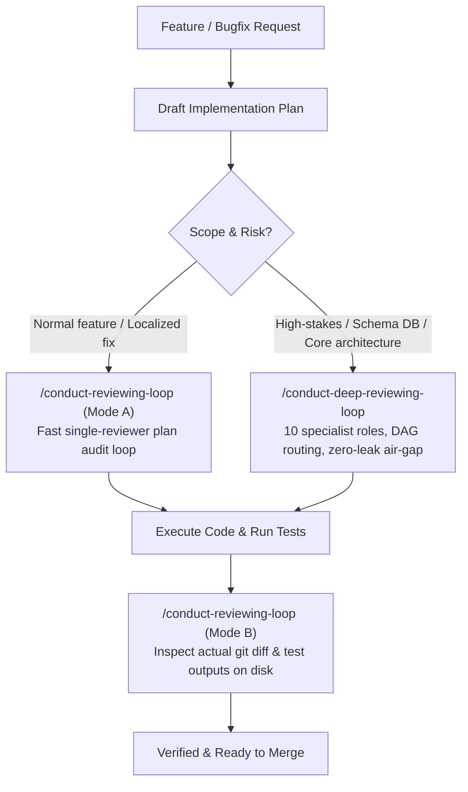

<h1 align="center">Conduct Reviewing Loop</h1>

<p align="center">
  <em>Force your AI coding assistant to stop grading its own homework.</em>
</p>

<p align="center">
  
  
  
  
</p>

---

## The Premise

AI coding agents love to tell you that their code is flawless. They write a broken plan, review their own draft in two seconds, give themselves a pass, and then ship bugs into your codebase because they want to finish the turn as quickly as possible.

If you ask the same agent "are you sure this works?", it will just scan what it wrote, say "looks solid", and pat itself on the back.

To actually catch bugs before and after writing code, you need two separate review workflows:
1. **Fresh-eyes plan audit**: A reviewer that treats the proposal as a first draft from a stranger, with no idea what round it is.
2. **Real git diff audit**: An implementation audit that checks the actual lines changed on disk and real test outputs instead of taking the agent's word for it.

This repo contains two skills that handle both ends of the engineering loop.

---

## How It Works: The Workflow

You do not need to overthink which tool to use. The workflow is a simple pipeline with a fork at the planning stage:



---

## When to Use Which

### 1. The Plan Stage (Before writing code)

- **Use `/conduct-reviewing-loop` (Mode A)**:
  - Best for: Normal features, UI adjustments, bug fixes, or localized module refactors.
  - What it does: Runs a fast review loop with a single fresh reviewer subagent. If the reviewer finds holes or missing edge cases, it forces revisions until the plan passes cleanly.

- **Use `/conduct-deep-reviewing-loop`**:
  - Best for: High-stakes architectural changes, database schema migrations, distributed state, concurrency, or core engine rewrites.
  - What it does: Spins up a multi-agent hierarchy with up to 10 isolated specialist roles across 4 dependency tiers (Data Migration, Testability, Performance, Observability, Security, etc.). Reviewers are strictly isolated from host reasoning so they cannot anchor on prior iterations.

### 2. The Implementation Stage (After writing code)

- **Use `/conduct-reviewing-loop` (Mode B)**:
  - Best for: Verifying actual modified files before commit or PR.
  - What it does: Ignores the proposal text and inspects the raw `git diff`, terminal test command results, lint errors, and unintended side effects on disk.

---

## Under the Hood: How They Actually Work

Both skills exist to stop AI sycophancy, but they use completely different mechanics depending on how dangerous the task is.

### 1. `/conduct-reviewing-loop`

This is a fast loop between two entities: the Author and a Fresh Reviewer.

- **Mode A (Plan Audit)**: The author drafts a plan. A fresh reviewer reads it from scratch and writes down blocking issues. The author patches the plan directly, and a completely new reviewer audits the clean text. This loops until the plan passes consecutive rounds without a single objection.
- **Mode B (Diff Audit)**: Once the code is written, the reviewer ignores all human conversation and audits only the raw `git diff` and terminal test outputs. If the agent forgot an edge case or wrote a fake test, it gets rejected right there.

```
Draft ➔ Fresh Reviewer #1 (Finds flaws) ➔ Patch Draft ➔ Fresh Reviewer #2 (Pass) ➔ Code ➔ Diff Audit
```

### 2. `/conduct-deep-reviewing-loop`

When you are touching databases, core engines, or security, a single reviewer is not enough. This skill builds a 3-layer assembly line with up to 10 specialized reviewers.

- **Layer 1 (Main Agent)**: Owns the code changes and applies clean mutations.
- **Layer 2 (Review Host & Critical Gate)**: The referee. Before round 1, it inspects your task and picks only the active specialists needed (like picking Data Migration for SQL changes, but skipping UI for a backend worker).
- **Layer 3 (The Specialists)**: Up to 10 isolated reviewers across 4 dependency tiers (Architect ➔ Readiness, Security, Data Migration, Testability ➔ Logic, Edgecase, Performance, Observability ➔ UI).

#### The Air-Gap Principle
Reviewers are strictly blinded. They never see round numbers, historical arguments, or each other's reports. They only see the current document and their domain checklist. This prevents the classic AI failure where reviewer #3 agrees with reviewer #2 just because it saw reviewer #2's output. **Every reviewer thinks this is the first time your plan is being reviewed.**

#### Dynamic DAG & Full Sweep
If an issue is found in Layer 3.2 (e.g. a broken database migration), only Layer 3.2, 3.3, and 3.4 are re-audited after the fix. Once all active targeted tiers pass, the Host runs a Full Sweep where 100% of the active team must audit the final static snapshot and pass unanimously.

---

## Key Rules Built In

- **Zero sycophancy**: Reviewers are forbidden from praising the draft or giving polite passes. If something is missing, they reject it with exact line citations.
- **Cognitive air-gap**: Reviewers never see round numbers, historical changelogs, or host opinions. Every review is evaluated with fresh eyes.
- **Evidence over assertion**: "It should work" is rejected. Every claim requires test commands, stdout assertions, or concrete code tracing.

---

## Install

### Claude Code Plugin (Recommended)

```bash
/plugin marketplace add loerei/conduct-reviewing-loop
```
```bash
/plugin install conduct-reviewing-loop@conduct-reviewing-loop
```

### Direct Git Clone (By Platform)

```bash
# For Gemini / Google Antigravity
git clone https://github.com/loerei/conduct-reviewing-loop.git ~/.gemini/config/skills/conduct-reviewing-loop

# For Claude Code (Global)
git clone https://github.com/loerei/conduct-reviewing-loop.git ~/.claude/skills/conduct-reviewing-loop

# For Cursor
git clone https://github.com/loerei/conduct-reviewing-loop.git ~/.cursor/skills/conduct-reviewing-loop

# For Codex / OpenAI
git clone https://github.com/loerei/conduct-reviewing-loop.git ~/.codex/skills/conduct-reviewing-loop

# For Current Project Workspace (Universal Agent Standard)
git clone https://github.com/loerei/conduct-reviewing-loop.git .agents/skills/conduct-reviewing-loop
```

Or sync across all workspaces via [`myskills`](https://github.com/loerei/myskills):
```bash
agents distribute
```

---

## License

MIT (c) [loerei](https://github.com/loerei)
