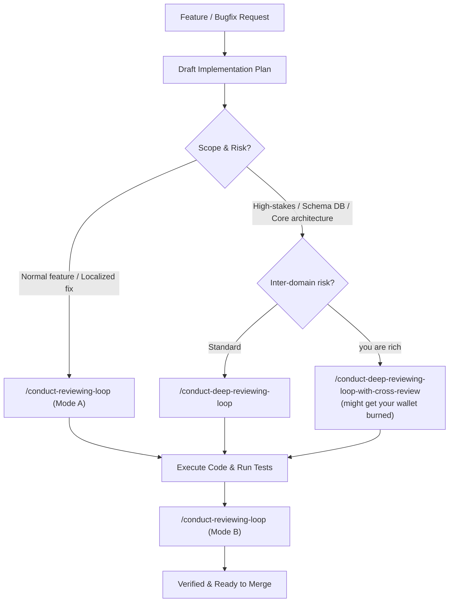

<h1 align="center">Conduct Reviewing Loop</h1>

<p align="center">
  <em>Force your AI coding assistant to stop grading its own homework.</em>
</p>

<p align="center">
  
  
  
  
</p>

---

## The Premise

AI coding agents love to grade their own homework. If you ask the same agent "are you sure this works?", it will scan what it just wrote, say "looks solid", and ship bugs into your codebase.

The fix is simple: **every reviewer treats the draft as if seeing it for the first time.**

Reviewers get zero chat history, zero memory of previous rounds, and zero host opinions. They evaluate the document with fresh eyes, require concrete proof for every claim (test runs, terminal outputs, code traces), and reject broken logic without hesitation.

This repo contains skills that handle both ends of the engineering loop: plan audits before writing code, and real git diff audits after.

---

## How It Works: The Workflow

You do not need to overthink which tool to use. The workflow is a simple pipeline with a fork at the planning stage:



---

## When to Use Which

### 1. The Plan Stage (Before writing code)

- **Use `/conduct-reviewing-loop` (Mode A)**:
  - Best for: Normal features, UI adjustments, bug fixes, or localized module refactors.
  - What it does: Runs an iterative blind review loop. Fresh subagents stress-test the draft sequentially from scratch until it achieves clean, consecutive PASSes.

- **Use `/conduct-deep-reviewing-loop`**:
  - Best for: High-stakes architectural changes, database schema migrations, distributed state, concurrency, or core engine rewrites.
  - What it does: Spins up a multi-agent hierarchy of blinded domain specialists over a dependency DAG to audit critical specs without anchoring bias.

- **Use `/conduct-deep-reviewing-loop-with-cross-review`**:
  - Best for: Complex specs where a fix proposed by one specialist risks missing standards in sibling domains, causing round bloat.
  - What it does: Everything in `/conduct-deep-reviewing-loop`, plus touched sibling specialists must cross-audit and approve remediation drafts before any fix touches the plan.
  - Cost note: Burns ~1.75x more tokens in a single round. But by resolving sibling standards upfront and eliminating 2 to 3 follow-up rounds, it might cut total token consumption by half on complex specs while producing unfragmented diffs.

### 2. The Implementation Stage (After writing code)

- **Use `/conduct-reviewing-loop` (Mode B)**:
  - Best for: Verifying actual modified files before commit or PR.
  - What it does: Audits the generated `.diff` artifact and test results directly against the approved plan to ensure 100% plan coverage, zero regressions, and full spec compliance.

---


## Install

### Claude Code Plugin (Recommended)

```bash
/plugin marketplace add loerei/conduct-reviewing-loop
```
```bash
/plugin install conduct-reviewing-loop@conduct-reviewing-loop
```

### Direct Git Clone (By Platform)

```bash
# For Gemini / Google Antigravity
git clone https://github.com/loerei/conduct-reviewing-loop.git ~/.gemini/config/skills/conduct-reviewing-loop

# For Claude Code (Global)
git clone https://github.com/loerei/conduct-reviewing-loop.git ~/.claude/skills/conduct-reviewing-loop

# For Cursor
git clone https://github.com/loerei/conduct-reviewing-loop.git ~/.cursor/skills/conduct-reviewing-loop

# For Codex / OpenAI
git clone https://github.com/loerei/conduct-reviewing-loop.git ~/.codex/skills/conduct-reviewing-loop

# For Current Project Workspace (Universal Agent Standard)
git clone https://github.com/loerei/conduct-reviewing-loop.git .agents/skills/conduct-reviewing-loop
```

Or sync across all workspaces via [`myskills`](https://github.com/loerei/myskills):
```bash
agents distribute
```

---

## License

MIT (c) [loerei](https://github.com/loerei)
